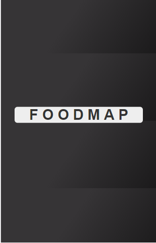
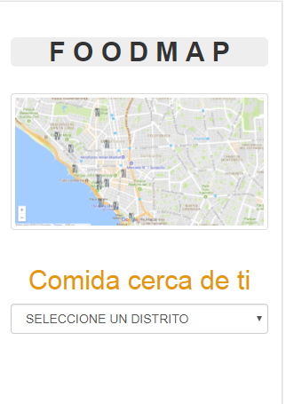

# "FOODMAP"

## RETO DE CÓDIGO

### OBJETIVO

Crea una web-app que a través de un input pueda filtrar los restaurantes que se encuentran cerca de ti (Tú decides la estructura que tendrán tus datos, puedes crear una lista de restaurantes en un arreglo, en un objeto, de manera individual. El diseño es totalmente libre).

### ETAPAS DEL DESARROLLO DEL PRODUCTO

#### PARTE 1

* Se identifica el objetivo a lograr y las tareas a realizar, para priorizar las actividades a realizar.

#### PARTE 2

* Se realiza el sketch (prototipo sencillo), e ideación del proyecto: tres distritos (Miraflores, Lince y Los Olivos), cada uno con dos restaurantes.

* Etapa de elaboración del producto en código. Se realizó lo siguiente

Se creó un archivo json, para guardar los base de datos.

Se creó un archivo index. HTML con la vista slash (logo centrado), y posterior la vista: fastFood.

Se creó un archivo main.css donde se encuentran todos los estilos aplicados a todas la partes del body del documento HTML.

### PARTE 3

* Se realiza la funcionalidad según lo solicitado en el reto.

### PARTE 4

* Se identifica las fortalezas del proyecto.

Vista inicial con vista slash, cumple lo necesario.

* Se identifica las debilidades del proyecto.

Vista fastFood, pendiente obtener los datos según cada distrito, funcionalidad.

* L. Vanessa Colqui Santos.